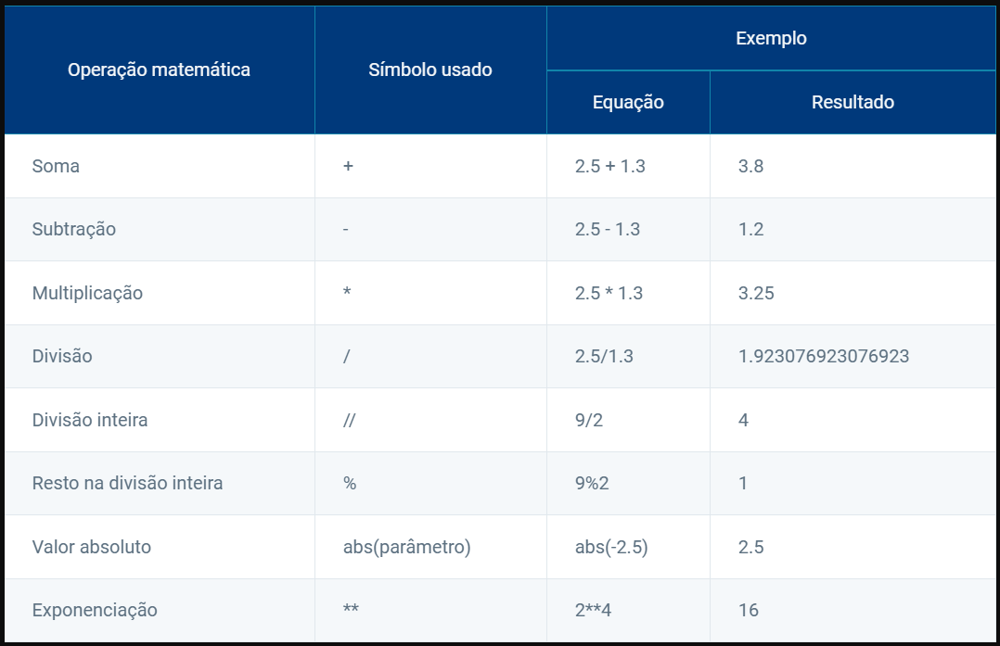
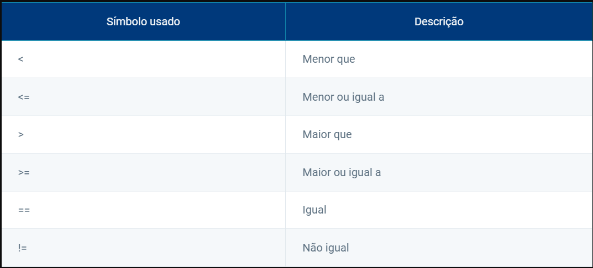
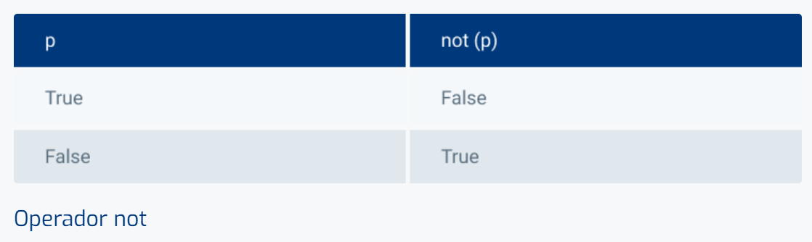
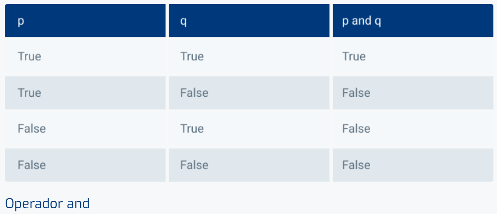
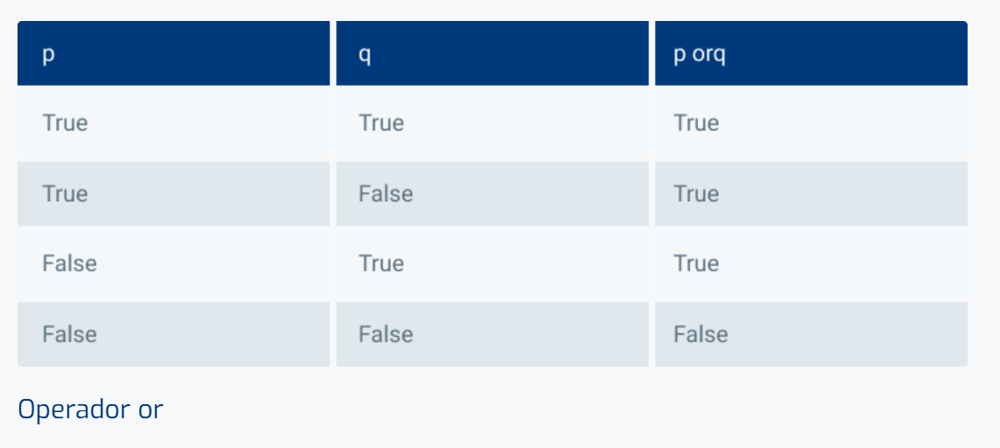

# Tipos de dados padrão

Devemos compreender os tipos numéricos e sequenciais, pois esse conhecimento é essencial para explorar todo o potencial da linguagem Python. Os tipos numéricos incluem inteiros (int) e números de ponto flutuante (float), que possibilitam realizar operações matemáticas e representar valores numéricos de diferentes formas. Dominar esses tipos de dados abre caminho para a criação de programas mais complexos e eficientes, permitindo representar e manipular uma gama de informações de forma flexível e poderosa.

# Conceitos

Agora, você será apresentado aos tipos de dados padrão incorporados ao interpretador Python. Veja os principais tipos internos:

**Tipos numéricos:**

Existem três tipos numéricos distintos em Python:
1. Números inteiros
2. Números de ponto flutuante
3. Números complexos

_Lembrando que os booleanos são um subtipo dos números inteiros._

O tipo **int**
É o tipo usado para manipular números inteiros. Fazendo uma analogia com a Matemática, o tipo int é usado para elementos do conjunto dos inteiros (Z).

_Observação:_ Diferentemente de outras linguagens, como C ou Java, a linguagem Python não limita o tamanho de uma variável de qualquer tipo, logo, não existe um valor inteiro máximo definido. O limite depende da quantidade de memória disponível no computador.

>>> 1_000_000
1000000
>>>
Python permite que você utilize o underline (_) como separador de milhar. Isso ajuda a visualizar números com muitos dígitos.

O tipo **float**

É o tipo usado para manipular números com parte inteira e parte decimal, chamados de números de ponto flutuante. Fazendo uma analogia com a matemática, o tipo float é usado para elementos do conjunto dos reais (R).
Devemos usar o ponto para separar a parte inteira da parte decimal, e não a vírgula.

O tipo **complex**
É o tipo utilizado para manipular números complexos, na forma x + yj, sendo x a parte real e y a parte imaginária do complexo.

O tipo **bool**
Uma expressão algébrica, como vimos nos exemplos dos tipos int e float, é avaliada como um número, seja desses tipos ou de outro tipo numérico admitido em Python. Porém, utilizar expressões não algébricas também é bastante comum. E uma boa notícia é que Python pode avaliar expressões desse tipo também. Essa é uma diferença entre Python e outras linguagens, como C, por exemplo, em que não existe o tipo bool.

_Observação:_ As expressões que você viu nos dois exemplos são chamadas de expressões booleanas. Trata-se de expressões que podem ser avaliadas com um dos dois valores booleanos, True ou False. Assim, em Python, existe o tipo bool, utilizado para permitir o tratamento de expressões como essas.
Agora, vamos ver o operador not, que é um operador unário, ou seja, só precisa de um operando. Esse operador inverte o valor booleano, ou seja, se o valor original for True, not(valor) terá o valor False. E vice-versa. Expressão not(2 < 3) 

# Operadores numéricos

**Operadores matemáticos:**
São muito semelhantes àqueles que vimos ao longo de nossa jornada como estudantes, aprendendo álgebra e aritmética na escola. Existem algumas pequenas diferenças, como a divisão (que pode ser a usual ou a divisão inteira). Mas é possível identificar operações que fizemos ao longo de toda nossa vida. A tabela a seguir lista os operadores de expressão aritmética disponíveis em Python. Relembre!

Além das operações algébricas, é possível realizar operações de comparação. Os operadores de comparação têm como resultado um valor booleano (True ou False). Observe a tabela a seguir:

**Operadores booleanos**
As expressões booleanas são aquelas que podem ter como resultado um dos valores booleanos True ou False. É comum utilizarmos os operadores de comparação em expressões booleanas, mas não só eles.
Assim como é possível escrever expressões algébricas complexas concatenando diversas expressões menores, podemos escrever expressões booleanas grandes, com os operadores and, or e not.
Observe o comportamento dos operadores booleanos nas três imagens a seguir.

