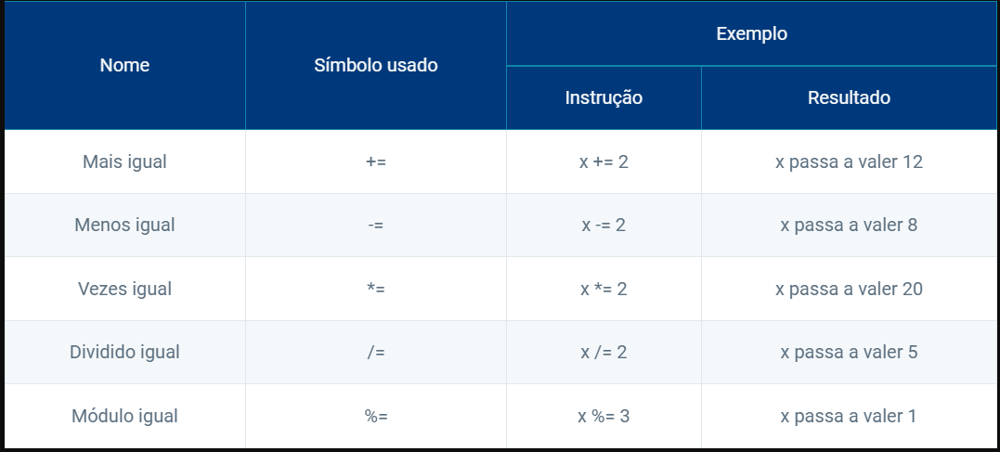

# Variáveis

**Formas de atribuição:**
Entender os conceitos de atribuição, entrada e saída de dados em Python é fundamental para qualquer programador, independentemente do nível de experiência. Atribuição é o processo de _associar um valor a uma variável_, permitindo que os dados sejam armazenados e manipulados durante a execução do programa. Por outro lado, a _entrada de dados_ refere-se à capacidade de receber informações do usuário, seja por meio do teclado, de arquivos ou de outros dispositivos externos. Já a _saída de dados_ envolve a exibição de resultados ou mensagens ao usuário, seja no console, em interfaces gráficas ou em arquivos.
Dominar esses conceitos é essencial para criar programas funcionais e interativos em Python, pois permite que os desenvolvedores criem aplicações que recebam, processem e exibam informações de forma eficiente e intuitiva. Já vimos, basicamente, como podemos atribuir valor a uma variável. Vamos agora conhecer outras formas de atribuição.

# Sentenças de atribuição

**Atribuição simples:**
Chamamos de atribuição simples a forma que já utilizamos neste conteúdo, com uma expressão parecida com x = 10. Nessa atribuição, a variável x recebe o valor 10.

**Atribuição múltipla:**
Python também permite a atribuição múltipla, ou seja, mais de uma variável receber atribuição na mesma linha.
Exemplo:
x, y = 2, 5
print(x)
print(y)

**Operadores de atribuição compostos:**
Os operadores de atribuição compostos executam operações matemáticas e atualizam o valor da variável utilizada.
Exemplo:
x = 10
x = x + 1
print(x)

Na tabela a seguir, estão os operadores compostos disponíveis em Python. 
Considere a variável x, com o valor inicial 10, para verificar os resultados:

**Troca de variáveis:**
Um dos problemas iniciais que envolvem atribuição de valores a variáveis é a troca entre duas delas. Suponha que as variáveis a e b armazenem, respectivamente, os valores 1 e 2. Caso quiséssemos inverter os valores em linguagens como C ou Java, seria necessário usar uma variável auxiliar. Em Python, é possível fazer essa troca de uma maneira muito mais fácil, com o uso da atribuição múltipla.