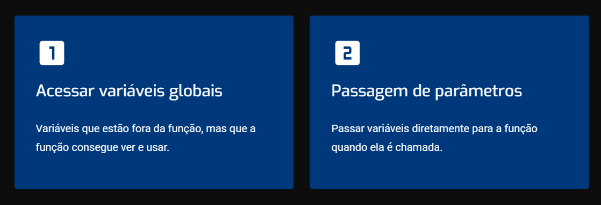
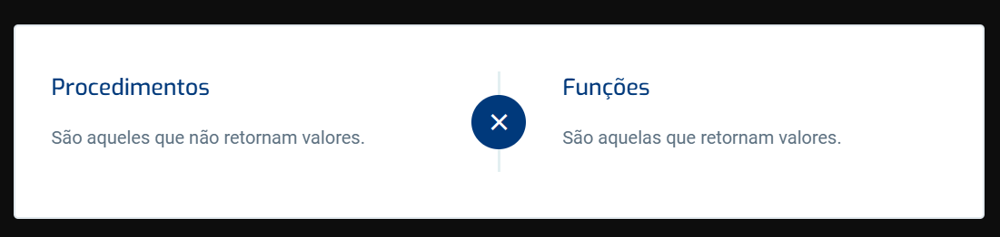

# O que são subprogramas?

São blocos de código que realizam tarefas específicas dentro de um programa maior. Eles são fundamentais para a organização e reutilização de código em linguagens de programação.
Em Python, chamamos subprogramas de **funções**.

# Características gerais dos subprogramas

_Ponto único de entrada:_
Cada subprograma tem um único ponto de entrada, que é onde sua execução começa.

_Suspensão do programa chamador:_
Quando um subprograma é chamado, o programa chamador é suspenso até que o subprograma termine sua execução.

_Retorno ao chamador:_
Após a execução do subprograma, o controle sempre retorna ao ponto de chamada no programa chamador.

# Definições básicas de subprogramas

Agora, vamos entender alguns conceitos básicos sobre subprogramas em Python.

**Definição de subprograma**
Um subprograma, ou função, é definido quando o desenvolvedor especifica nome, parâmetros (se houver) e o conjunto de ações que ele executará. Isso cria uma "interface" que descreve como a função deve ser chamada e o que ela faz.

**Chamada de subprograma**
Uma função é chamada quando o programa executa uma instrução que solicita explicitamente a execução dessa função. Essa chamada ativa a função, fazendo com que o Python execute o bloco de código associado a ela.

**Ativação do subprograma**
Uma vez chamada, a função se torna ativa. Ela continua em execução até que todas as instruções dentro dela sejam executadas. Quando a função termina, o controle retorna ao ponto de onde a função foi chamada.

**Cabeçalho do subprograma**
O cabeçalho de uma função é a primeira parte da definição da função. Ele inclui o nome da função e, opcionalmente, uma lista de parâmetros.

Vejamos agora um exemplo. Em Python, você define uma função com a palavra-chave def, seguida pelo nome da função e parênteses contendo os parâmetros, se houver. Observe:

def minha_funcao(parametro1, parametro2):
    # Corpo da função
    pass

# Definindo e chamando subprogramas
Em Python, as funções definidas pelo desenvolvedor devem ser precedidas pela palavra reservada def. Não são especificados o tipo de retorno e os tipos dos parâmetros.
Vamos criar uma primeira função para imprimir o clássico “Olá Mundo!” em Python. Como ficaria:

def diz_ola():
    print("Olá, Mundo!")

# Parâmetros, procedimentos e funções

**Parâmetros em Python**
Vamos falar sobre parâmetros! Quando você cria uma função em Python, ela geralmente precisa de alguns dados para trabalhar. Existem duas maneiras principais para uma função obter esses dados, observe:

_O que são parâmetros?_
São os valores que você passa para a função quando a chama. Vamos ver um exemplo:

def calculaIMC(peso, altura):
    return peso / (altura ** 2)

**Procedimentos e funções**
Os subprogramas podem ser procedimentos e funções. Veja a diferença entre eles:
