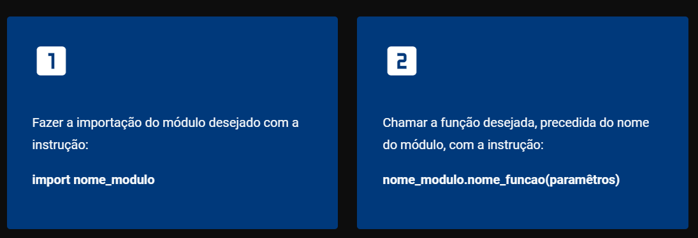
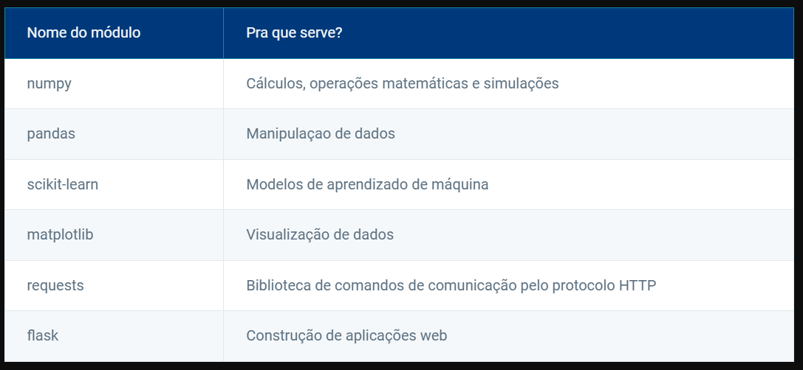

## BIBLIOTECAS

# Importação de funções e módulos

Vamos explorar a importação de funções e módulos em Python! Você aprenderá a importar bibliotecas nativas da linguagem e a utilizar funções importadas em seu programa. Isso ampliará sua capacidade de desenvolvimento e facilitará a reutilização de código.

# Biblioteca padrão Python
Python oferece, em seu núcleo, algumas funções que já utilizamos, como print() e input(), além de classes, como int, float e str. Logicamente, o núcleo da linguagem Python disponibiliza muitas outras funções (ou métodos) e classes além das citadas. Mas, ainda assim, ele é pequeno, tendo o objetivo de simplificar o uso e ganhar eficiência.
Para aumentar a disponibilidade de funções, métodos e classes, o desenvolvedor pode usar a biblioteca padrão Python. Neste material, apresentaremos alguns dos principais recursos dessa biblioteca e a forma de utilizá-los.

A biblioteca padrão Python (Python Standard Library) consiste em milhares de funções, métodos e classes relacionados a determinada finalidade e organizados em componentes chamados de módulos. Há mais de 200 módulos que dão suporte, entre outras coisas, a:

1. Operações matemáticas.
2. Interface gráfica com o usuário (GUI).
3. Funções matemáticas e geração de números pseudoaleatórios.

Lembre-se dos conceitos de classes e objetos, pois eles são os principais conceitos do paradigma de programação orientada a objeto.
As classes são fábricas, que podem gerar instâncias chamadas objetos.

# Como usar uma função de módulo importado?

Para usar as funções e os métodos de um módulo, são necessários dois passos. Acompanhe:

import math

x = math.sqrt(5)
print(x)

# Pacotes externos

Agora, vamos explorar os pacotes externos do Python! Utilizaremos o pip, a ferramenta padrão de gerenciamento de pacotes do Python, para instalar e gerenciar pacotes externos, desde bibliotecas científicas até ferramentas de desenvolvimento web. Você aprenderá a acessar e utilizar diversos recursos para aprimorar seus projetos e ampliar suas habilidades de programação, além de criar seus próprios módulos.

**Usando pacotes externos**
Além dos módulos fornecidos de forma integrada pela biblioteca padrão do Python, a linguagem possui uma grande vantagem: sua característica open-source permite que qualquer desenvolvedor, com o conhecimento adequado, desenvolva a própria biblioteca e os próprios módulos, os quais chamaremos, a partir de agora, de pacotes. Veremos como criar módulos mais adiante neste conteúdo.

Com um pacote pronto, o desenvolvedor pode disponibilizar esse material na internet de forma que qualquer pessoa possa aproveitar o código implementado. Isso foi um dos fatores que fez com que o Python se tornasse uma das linguagens mais utilizadas no mundo atualmente.

