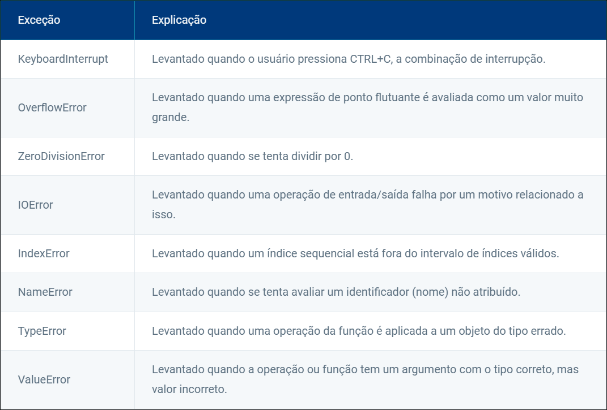
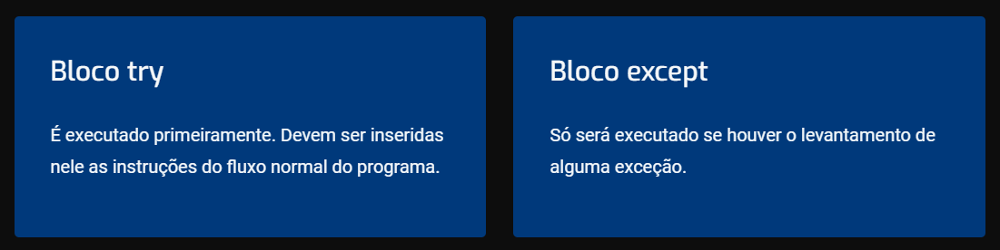

# Erros em um programa Python

Vamos agora identificar, compreender e lidar com diferentes tipos de erros: erros de sintaxe, exceções e falhas de lógica.

## Erros e exceções

Até agora consideramos que nossos programas tiveram seu fluxo de execução normal. Neste conteúdo, vamos analisar o que acontece quando o fluxo de execução é interrompido por uma exceção, além de controlar esse fluxo excepcional.

Dois tipos básicos de erros podem acontecer em um programa em Python. Os erros de sintaxe são aqueles que ocorrem devido ao formato incorreto de uma instrução. Esses erros são descobertos pelo componente do interpretador Python, que é chamado analisador ou parser.
Além deles, existem os erros que ocorrem em tempo de execução do programa, que não se devem a uma instrução escrita errada, e sim ao fato de que o programa entrou em um estado indevido.

Elencamos os seguintes exemplos, observe:

A divisão por 0.
A tentativa de acessar um índice indevido em uma lista.
Um nome de variável não atribuído.
Um erro causado por tipos incorretos de operando.
Em cada caso, quando o programa atinge um estado inválido, é dito que o interpretador Python levanta uma exceção. Isso significa que é criado um objeto que contém as informações relevantes sobre o erro.

A tabela a seguir traz alguns tipos comuns de exceção. Conheça:

Em Python, as exceções são objetos. A classe Exception é derivada de BaseException, classe base de todas as classes de exceção. BaseException fornece alguns serviços úteis para todas as classes de exceção, mas normalmente não se torna uma subclasse diretamente.

## Tratamento de exceções e eventos

Vamos agora dominar o tratamento de exceções e eventos em Python! Você aprenderá a utilizar blocos try-except para lidar com exceções de forma eficaz. Além disso, vai descobrir como capturar e responder a eventos em seus programas, como cliques de mouse de tecla.

**Captura e manipulação de exceções**
Para evitar que os programas sejam interrompidos quando uma exceção é levantada, é possível planejar um comportamento alternativo. Assim, o programa não será interrompido e a exceção poderá ser tratada. Chamamos esse processo de captura da exceção.
Vamos considerar um exemplo de programa que solicita ao usuário, com a função input(), um número inteiro. Embora essa função trate a entrada do usuário como string, é possível utilizá-la em conjunto com a função eval() para que os dados inseridos sejam avaliados como números.

Exemplo:

try:
    num = eval(input("Entre com um número inteiro: \n"))
    print(num)
except:
    print("Entre com o valor numérico e não letras")

